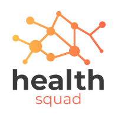

<h1 align="center"> Health Squad </h1>  

  

> Check out a brief demo of my project.
> Demo [_here_](https://github.com/JoyE-HOU/final-project_health-squad_frontend).

## Table of Contents
* [General Info](#general-information)
* [Technologies Used](#technologies-used)
* [Features](#features)
* [Screenshots](#screenshots)
* [Setup](#setup)
* [Usage](#usage)
* [Project Status](#project-status)
* [Room for Improvement](#room-for-improvement)
* [Acknowledgements](#acknowledgements)
* [Contact](#contact)
<!-- * [License](#license) -->

## General Information
- Provide general information about your project here.
- What problem does it (intend to) solve?
- What is the purpose of your project?
- Why did you undertake it?
<!-- You don't have to answer all the questions - just the ones relevant to your project. -->

## Technologies Used
- Tech 1 - version 1.0
- Tech 2 - version 2.0
- Tech 3 - version 3.0

## Features
A few of the things you can do with GitPoint:

- Add/edit medications
- Create "Add to Calendar" events
- Download PDF of current medications

## Screenshots

  
  
  
  

## Setup
What are the project requirements/dependencies? Where are they listed? A requirements.txt or a Pipfile.lock file perhaps? Where is it located?

Proceed to describe how to install / setup one's local environment / get started with the project.

## Usage
How does one go about using it?
Provide various use cases and code examples here.

`write-your-code-here`

## Project Status
Project is: _in progress_.

## Room for Improvement
Include areas you believe need improvement / could be improved. Also add TODOs for future development.

Room for improvement:
- Improvement to be done 1
- Improvement to be done 2

To do:
- Feature to be added 1
- Feature to be added 2

## Acknowledgements
Give credit here.
- This project was inspired by my mother, Deborah Evans. Love you!!!
- Many thanks to my instructors and cohort at Flatiron School.

## Contact
Created by [@joy-evans](https://joy-evans.medium.com/) - feel free to contact me!

<!-- Optional -->
<!-- ## License -->
<!-- This project is open source and available under the [... License](). -->

<!-- You don't have to include all sections - just the one's relevant to your project -->

